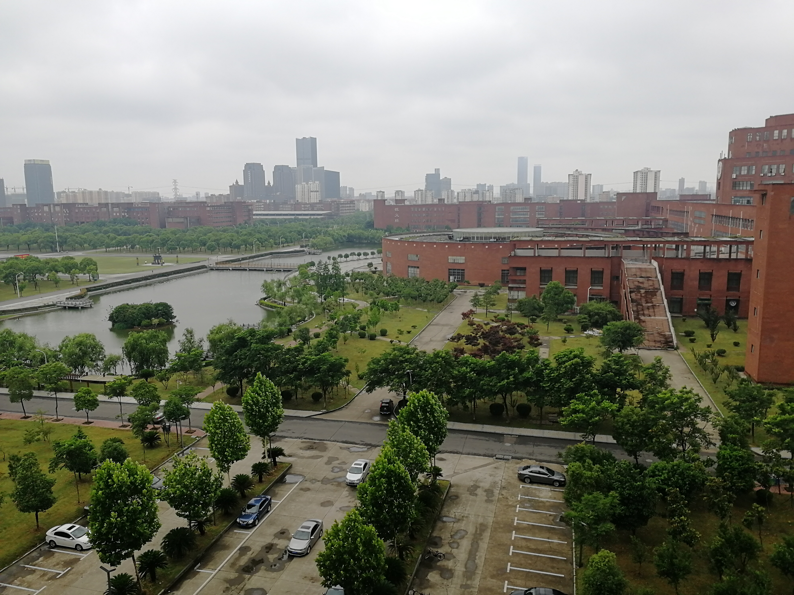

    发现生活美~

> *世界那么大，我想去看看~ ——顾老师 《仅十个字的辞职信》*
>
> *我们不是用相机在拍照，我们带到摄影中去的是你曾经读过的书，看过的电影，听过的音乐，走过的路，爱过的人。——安塞尔·亚当斯*

2018

	<ul style="margin:0px 0 0 0;" aligin="left">
        <li style="list-style-type:none;"></li>
        <li style="list-style-type:none;"></li>
    </ul>

---

    音乐和影视~

> *欢迎下方评论分享你觉得不错的音乐和电影，也欢迎分享你的故事~* 

听听歌

 

<iframe frameborder="no" border="0" marginwidth="0" marginheight="0" width=530 height=470 src="//music.163.com/outchain/player?type=0&id=2637966813&auto=0&height=430"></iframe>

---

周杰伦音乐MV100分钟大合集--经典回味

  

<iframe height=300 width=510 src='http://player.youku.com/embed/XMTU0ODEwMzM3Ng==' frameborder=0 'allowfullscreen'></iframe>